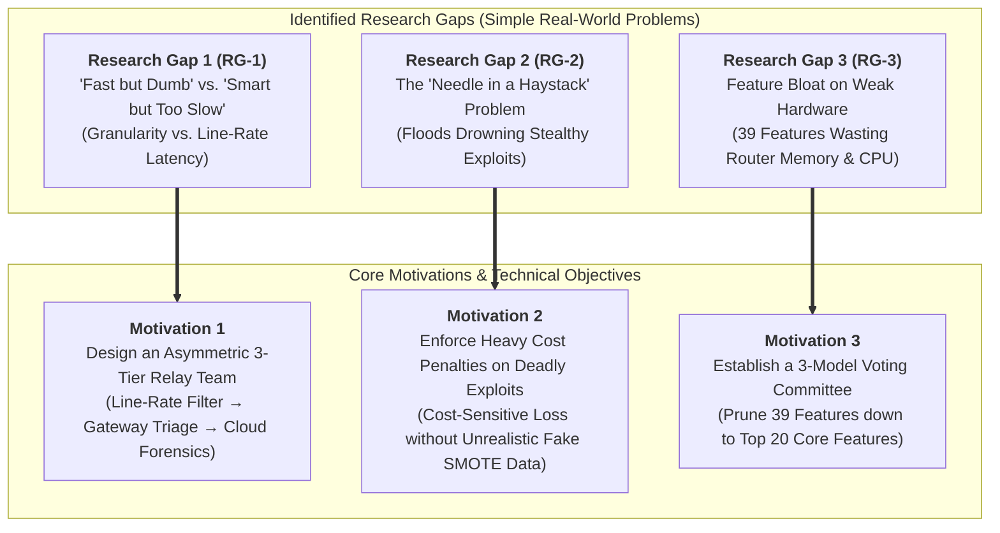
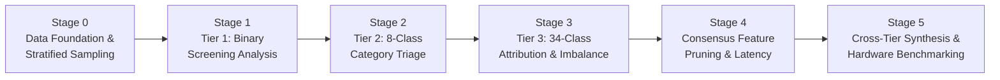
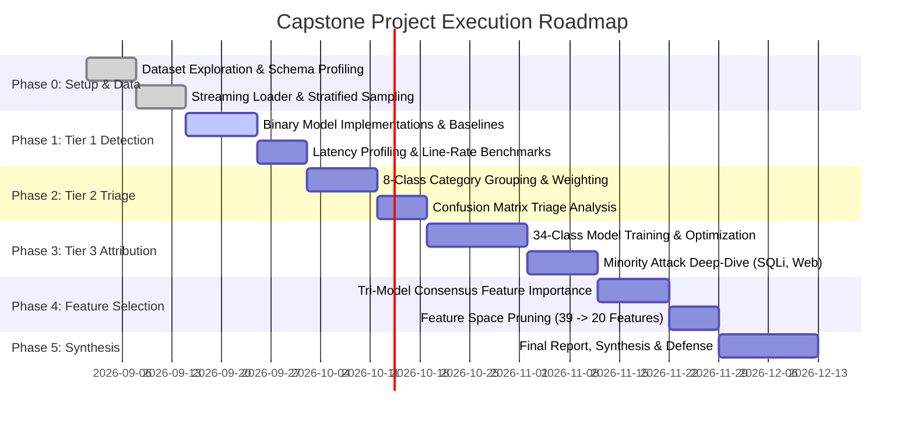

# Capstone Project Review 2: Project Proposal & Technical Blueprint

**Project Title:** IoT Network Attack Detection and Classification  
**Project Domain:** Cyber-Physical System Security, IoT Network Traffic Analytics, Machine Learning & Line-Rate IDS  
**Academic Institution:** Shiv Nadar University Chennai &mdash; Department of Computer Science & Engineering  
**Academic Year:** 2026&ndash;2027  

---

### Team & Faculty Details

- **Student Members (Team Archon):**
  - **Priyajit Biswal** &mdash; Register No: `23011102068` (Email: `priyajit23110510@snuchennai.edu.in`)
  - **Rohit K Manoj** &mdash; Register No: `23011102073` (Email: `rohit23110492@snuchennai.edu.in`)
  - **Rishab Rajeev** &mdash; Register No: `23011102072` (Email: `rishab23110023@snuchennai.edu.in`)

- **Faculty Supervisor:**
  - **Dr. Vegesna S M Srinivasavarma**, Associate Professor, Department of Computer Science & Engineering, Shiv Nadar University Chennai (Email: `srinivasv@snuchennai.edu.in`)

---

## 1. Executive Summary & Problem Context

The accelerated deployment of Internet of Things (IoT) devices across industrial automation, smart healthcare, intelligent power grids, and connected urban infrastructure has introduced an unprecedented attack surface. IoT endpoints are fundamentally characterized by **heterogeneous protocols**, **severe computational and memory constraints**, and **minimal native cryptographic capabilities**. Consequently, compromised IoT nodes are routinely co-opted into massive distributed botnets (e.g., Mirai, Bashlite) to launch multi-gigabit volumetric denial-of-service floods, or exploited via subtle, multi-stage application exploits (e.g., SQL Injection, Remote Command Execution, Backdoors).

Traditional enterprise Network Intrusion Detection Systems (NIDS) rely either on static rule-based pattern matching (e.g., Snort, Zeek) or centralized, monolithic Deep Learning (DL) models. In high-speed IoT gateway environments operating at 1 Gbps to 10 Gbps line rates, both paradigms encounter catastrophic bottlenecks:
1. Rule-based systems fail to generalize to zero-day polymorphic traffic patterns and impose severe CPU inspection penalties.
2. Monolithic deep learning models require heavy tensor computations and high memory bandwidth, introducing millisecond-level per-packet inference latencies that exhaust gateway buffer queues and cause packet drops.
3. Existing systems operate predominantly as crude binary alarms (`Attack` vs. `Benign`), withholding the fine-grained diagnostic telemetry required for automated micro-segmentation and forensic remediation.

This capstone project proposes an **Adaptive, Multi-Tier Network Intrusion Detection and Attribution Architecture** designed to balance fine-grained classification granularity against the strict line-rate latency constraints of resource-bounded edge networks.

---

## 2. Literature Survey & Limitations of Prior Work

| Study & Authors | Benchmark Dataset | Methodology / Approach | Key Contributions | Critical Limitations & Open Issues |
| :--- | :--- | :--- | :--- | :--- |
| **Neto et al. (2023)**<br>*Sensors (MDPI)* | CICIoT2023 (46.6M flows) | Supervised baselines (Random Forest, Decision Tree, Logistic Regression) | Introduced realistic 105-device IoT testbed with 33 modern attacks across 7 categories | Evaluated on static offline partitions; did not address line-rate edge deployment latency or fine-grained 34-class minority attribution under extreme class skew. |
| **Koroniotis et al. (2019)**<br>*Future Generation Comp. Syst.* | BoT-IoT | Deep Learning (RNNs, SVM, Random Forest) | Evaluated botnet attack behaviors (Mirai, Bashlite) in smart home topologies | Severe synthetic volumetric skew (>99.9% flooding flows); lacks normal benign baseline realism and modern web application exploit vectors. |
| **Al-Hawawreh et al. (2018)**<br>*J. Inf. Secur. Appl.* | Industrial IoT Telemetry | Deep Autoencoders (DAE) & Deep Neural Networks | Developed anomaly detection models for industrial IoT and SCADA protocols | High computational latency and memory footprint; designed for specialized industrial telemetry rather than high-speed consumer edge gateways. |
| **Ferrag et al. (2020)**<br>*J. Inf. Secur. Appl.* | CSE-CIC-IDS2018, UNSW-NB15 | Convolutional Neural Networks (CNN) & Deep Feed-Forward (DNN) | Comprehensive comparative benchmark of deep learning architectures for network IDS | Tested on legacy enterprise IT topologies rather than constrained IoT networks; severe accuracy collapse on extreme minority attack vectors. |
| **Mirsky et al. (2018)**<br>*NDSS Symposium* | Kitsune (Physical IoT Testbed) | Ensemble of Autoencoders (KitNET) with online feature mapping | Sub-microsecond online anomaly detection on streaming packets on embedded hardware | Operates strictly as a binary anomaly detector; incapable of multi-class threat triage or distinguishing stealthy application-layer exploits. |
| **Ferrag et al. (2022)**<br>*IEEE Access* | Edge-IIoTset | Centralized ML & Distributed Federated Learning (FL) | Realistic multi-vector dataset incorporating 14 attacks across IoT and IIoT devices | Attack traffic originated from external attacking workstations rather than compromised peer IoT hardware; heavy feature dimensionality (61 features). |

---

## 3. Identification of Concrete Research Gaps

Through systematic analysis of existing academic literature and empirical evaluations of modern IoT traffic profiles, this project identifies three fundamental, practical research gaps:



### Research Gap 1 (RG-1): The Granularity vs. Line-Rate Latency Dilemma ("Fast but Dumb" vs. "Smart but Too Slow")
* **In Simple Words:**  
  In high-speed IoT networks, millions of packets pass through every second. Current security systems face an impossible trade-off:
  - A simple **binary classifier** (`Attack` vs. `Benign`) is extremely fast (under 1 microsecond), but it is **dumb**—it only sounds an alarm without identifying the attack type, leaving administrators blind on how to stop it.
  - A complex **multi-class deep learning model** can identify exact attacks, but it is **too slow** (taking 15 ms to 80 ms per packet). At 10 Gbps line-rates (>1.48 million packets/second), packets pile up, buffer queues overflow, the router drops packets, and the network chokes.
* **Technical Definition:** Existing NIDS architectures exhibit an irreconcilable conflict between inspection throughput and diagnostic specificity. Deploying monolithic multi-class deep learning models directly on high-speed edge ingress points causes packet queuing delays and buffer exhaustion, forcing security to be disabled during peak volumetric loads.

### Research Gap 2 (RG-2): Severe Multi-Class Skew & Minority Attack Starvation ("The Needle in a Haystack")
* **In Simple Words:**  
  Real-world IoT traffic is overwhelmingly dominated by massive volumetric floods. In benchmarks like CICIoT2023, **DDoS/DoS attacks make up over 85% to 90% of all traffic**, while the most dangerous attacks—such as hackers injecting malicious code into smart devices (**SQL Injection, Command Injection, Backdoors**)—make up **less than 0.05%** (a tiny fraction of packets).
  - Normal machine learning models get lazy: by guessing "DDoS" every time, a model scores **99% global accuracy**, but achieves **0% detection** on deadly web attacks!
  - Common remedies like SMOTE synthesize artificial data points in continuous space, creating fake network packets with impossible packet sizes and broken timestamps that do not exist in real computer networks.
* **Technical Definition:** Extreme class imbalance leads standard empirical risk minimization algorithms to ignore minority classes to minimize global loss. Synthetic oversampling methods (SMOTE, ADASYN) violate the discrete, sequential nature of network packet flows, corrupting protocol kinematics and generating unphysical artifacts.

### Research Gap 3 (RG-3): High Feature Dimensionality vs. Edge Gateway Resource Budgets ("Feature Bloat on Weak Hardware")
* **In Simple Words:**  
  Network flow tools extract **39 to 80+ statistical metrics** for every single connection (packet sizes, timing, flags, protocols like IRC, Telnet, DHCP, SMTP). Small IoT edge routers (like home Wi-Fi routers or Raspberry Pi gateways) have very limited RAM and weak processors.
  - Computing and storing 39 numbers for millions of connections fills up the router's memory cache and slows down processing.
  - Many of these features are useless noise (e.g., modern IoT devices rarely use ancient protocols like IRC or Telnet).
  - Existing feature reduction methods (like PCA) blur features into weird mathematical formulas that still require calculating all 39 original features first!
* **Technical Definition:** High feature dimensionality creates memory overhead in edge packet state tables and increases decision tree evaluation depth. Single-criterion linear pruning heuristics either discard non-linear interactions or produce uninterpretable projected features that fail to reduce upstream extraction overhead.

---

## 4. Research Gap to Motivation & Proposed Solution Mapping

To directly address these three challenges, our project establishes an explicit, intuitive one-to-one mapping:

| # | Identified Research Gap (Plain Words) | Root Cause in Existing Work | Project Motivation | Proposed Technical Solution & Methodology | Expected Verification Metric |
| :-: | :--- | :--- | :--- | :--- | :--- |
| **RG-1** | **Fast vs. Smart Dilemma:** Fast models are dumb (binary); smart models are too slow and cause buffer overflows. | Monolithic models try to do everything at once at the packet boundary. | Decouple fast line-rate screening from compute-intensive root-cause forensics. | **Asymmetric 3-Tier Relay Team:**<br>&bull; **Tier 1 (Bouncer):** Sub-microsecond linear filter (`SGD Logistic Loss`) for immediate line-rate binary screening.<br>&bull; **Tier 2 (Triage):** Edge gateway ensemble (`LightGBM/XGBoost`) for 8-class functional category triage.<br>&bull; **Tier 3 (Specialist):** High-capacity forensic model (`XGBoost / Tabular DNN`) in core/cloud for 34-class fine-grained attribution. | &bull; Tier 1 latency $< 1.0\,\mu\text{s}$<br>&bull; Line throughput $> 10^6$ flows/sec<br>&bull; Graceful accuracy trajectory across tiers |
| **RG-2** | **Needle in a Haystack:** Floods drown out stealthy exploits; models get 99% accuracy but 0% recall on deadly attacks. | Loss functions treat all errors equally; synthetic data (SMOTE) creates unphysical fake packets. | Protect rare, high-severity attacks without corrupting real network packet dynamics. | **Cost-Sensitive Inverse Class Weighting:**<br>Mathematically penalize minority misclassifications heavily without generating fake packets:<br>$$W_c = \frac{N_{\text{total}}}{K \cdot N_c}$$<br>Missing a rare SQL Injection receives 10,000&times; higher penalty than missing a common DDoS packet during gradient backpropagation. | &bull; High Recall on minority exploits (SQLi, Command Injection, Backdoor)<br>&bull; Macro F1 improvement $>15\%$ over unweighted models |
| **RG-3** | **Feature Bloat on Weak Hardware:** 39 features overload router RAM and slow down inference. | Feature extractors dump dozens of redundant, collinear protocol counters into memory. | Prune protocol noise and reduce memory footprint while keeping detection accuracy intact. | **3-Model Consensus Feature Voting Committee:**<br>Let three distinct model architectures vote on feature importance:<br>&bull; Gini Impurity (Random Forest)<br>&bull; Information Gain (XGBoost)<br>&bull; Split Count (LightGBM)<br>Discard useless features (IRC, Telnet, DHCP) and retain the **top 20 core features**. | &bull; Memory footprint cut by $\approx 48\%$<br>&bull; Inference speedup $\ge 25\%$<br>&bull; Accuracy retained within $\pm 2\%$ of full 39 features |

---

## 5. Proposed System Architecture: Three-Tier Hierarchical Framework

Rather than forcing a single model to satisfy contradictory performance requirements, the proposed framework implements an **Asymmetric Three-Tier Diagnostic Hierarchy**:

```
                       [ Incoming IoT Network Flow Stream ]
                                      │
                                      ▼
             ┌──────────────────────────────────────────────────┐
             │       TIER 1: Line-Rate Binary Packet Filter     │
             │   (Sub-Microsecond Edge Ingress Screening)      │
             │   Target: Benign vs. Malicious (2 Classes)       │
             │   Candidate: SGD Linear Classifier / Fast Trees  │
             └────────────────────────┬─────────────────────────┘
                                      │
                         ┌────────────┴────────────┐
                         │                         │
                  [ Benign Traffic ]        [ Attack Traffic ]
                         │                         │
                         ▼                         ▼
                  (Normal Forwarding) ┌─────────────────────────┐
                                      │  TIER 2: Gateway Triage │
                                      │  (Functional 8-Class)   │
                                      │  Target: DDoS, DoS,     │
                                      │  Mirai, Recon, Web, etc.│
                                      │  Candidate: LightGBM    │
                                      └────────────┬────────────┘
                                                   │
                                      ┌────────────┴────────────┐
                                      │                         │
                             [ Volumetric Floods ]       [ Stealthy Exploits ]
                                      │                         │
                                      ▼                         ▼
                              (Automated Port &         ┌─────────────────────────┐
                              Rate Limiting Rule)       │  TIER 3: Core Forensics │
                                                        │  (Fine-Grained 34-Class)│
                                                        │  Target: Specific CVEs, │
                                                        │  SQLi, XSS, Backdoors   │
                                                        │  Candidate: XGBoost/DNN │
                                                        └─────────────────────────┘
```

### Architectural Breakdown:
1. **Tier 1: High-Speed Line-Rate Screening (Edge Ingress Layer)**
   - **Operational Objective:** Filter benign background traffic and flag anomalous flows with deterministic, sub-microsecond response time.
   - **Computational Requirement:** Linear computational complexity $\mathcal{O}(d)$; zero branching stalls; minimal packet delay variation (jitter).
   - **Target Output:** Binary decision (`Benign` vs. `Malicious`).

2. **Tier 2: Functional Category Triage (Local Gateway Layer)**
   - **Operational Objective:** Isolate the broad threat category (`DDoS`, `DoS`, `Mirai`, `Reconnaissance`, `Spoofing`, `Web`, `Brute Force`).
   - **Actionable Response:** Volumetric floods (e.g., UDP/SYN floods) are immediately dropped or rate-limited via OpenFlow/SDN switches at the local edge switch without burdening higher tiers.
   - **Target Output:** 8 functional categories.

3. **Tier 3: Fine-Grained Attack Attribution (Central Core / Forensic Cloud Layer)**
   - **Operational Objective:** Conduct deep telemetry attribution across all 33 specific attack signatures (e.g., distinguishing `Command Injection` from `SQL Injection` or `Browser Hijacking`).
   - **Actionable Response:** Isolates infected host nodes, triggers virtual patch updates, updates firewall blacklists, and alerts incident response teams.
   - **Target Output:** 34 granular classes.

---

## 6. Proposed Methodological Stages & Experimental Plan

The project is structured into six methodical phases designed to systematically investigate, validate, and optimize the proposed architecture:



### Stage 0: Data Engineering, Protocol Profiling & Stratified Sampling
- **Dataset Scope:** The benchmark dataset **CICIoT2023** comprises 46.6 million flows across 63 raw CSV partitions and 39 extracted network attributes (packet size statistics, TCP flags, protocol distribution counters, and flow timing features).
- **Stratified Representative Sampling Plan:** Because loading 46.6M rows requires over 25 GB RAM, we propose an algorithmically verified chunked streaming extraction pipeline:
  - Cap excessively redundant majority flood classes (`DDoS-ICMP_Flood`, `DDoS-UDP_Flood`) to avoid memory saturation.
  - **Preserve 100% of all rare, stealthy minority attack instances** (`SQLInjection`, `CommandInjection`, `Backdoor_Malware`, `Uploading_Attack`, `DictionaryBruteForce`).
  - Maintain a statistically robust sample (>500,000 instances) preserving the true mathematical probability distributions of the underlying network.

### Stage 1: Tier 1 Binary Classification Exploration
- **Objective:** Evaluate candidate models for the line-rate screening layer.
- **Candidate Architectures:**
  - `SGDClassifier` with modified log-loss (Linear Logistic Regression baseline for line-rate edge execution).
  - `RandomForestClassifier` (parallel bagging baseline).
  - `LightGBM` (histogram-based fast gradient boosting).
  - `XGBoost` (exact greedy boosting).
  - Multi-layer Deep Neural Network (`PyTorch Tabular DNN` with BatchNorm and Dropout).
- **Core Evaluation Dimensions:** Inference latency ($\mu\text{s}/\text{flow}$), memory footprint, ROC-AUC, and True Positive / False Positive rates.

### Stage 2: Tier 2 Functional 8-Category Classification
- **Objective:** Evaluate multi-class triage across 8 functional groups.
- **Key Methodological Focus:**
  - Compare unweighted loss against Cost-Sensitive Balanced Class Weighting.
  - Evaluate per-category confusion matrices to identify structural misclassifications between conceptually adjacent attacks (e.g., `DDoS` vs. `DoS`, or `Mirai` botnet floods vs. generic UDP floods).

### Stage 3: Tier 3 Fine-Grained 34-Class Forensic Attribution
- **Objective:** Build and validate high-resolution attribution models across all 33 attack signatures + Benign traffic.
- **Key Methodological Focus:**
  - Tackle severe minority starvation under extreme class imbalance ($>10,000 : 1$ ratio between majority and minority classes).
  - Benchmark performance using non-deceptive metrics: **Macro-averaged F1**, **Per-class Recall**, and **Precision-Recall Area Under Curve (PR-AUC)**.

### Stage 4: Tri-Model Consensus Feature Pruning & Latency Profiling
- **Objective:** Establish an algorithm-agnostic ranking of the 39 features by aggregating:
  1. Mean Gini Impurity Reduction from Random Forest: $I_{\text{Gini}}(f)$
  2. Information Gain Variance from XGBoost: $I_{\text{Gain}}(f)$
  3. Total Split Frequency from LightGBM: $I_{\text{Split}}(f)$
- **Pruning Strategy:** Prune near-zero utility features (e.g., legacy protocol flags rarely invoked in modern IoT networks such as `IRC`, `DHCP`, `SMTP`, `Telnet`, `CWR`) down to a compact 20-feature core set.
- **Validation:** Re-evaluate inference latency, CPU instruction counts, and accuracy retention on the reduced feature space.

### Stage 5: Unified Capstone Synthesis & Pareto Trade-Off Analysis
- **Objective:** Synthesize cross-tier experimental findings into a deployment blueprint.
- **Deliverables:**
  - Pareto Frontier curves visualizing the trade-off between classification granularity, Macro F1, and per-sample latency.
  - Empirical verification of the line-rate deployment feasibility of each tier.

---

## 7. Performance Evaluation Metrics & Validation Strategy

To prevent misleading performance claims often encountered in imbalanced IoT security literature, the proposed evaluation framework adopts rigorous validation protocols:

1. **Classification Quality Metrics:**
   - **Macro-Averaged F1-Score:** 
     $$\text{Macro F1} = \frac{1}{C} \sum_{c=1}^{C} \frac{2 \cdot P_c \cdot R_c}{P_c + R_c}$$
     Treats every attack class with equal importance regardless of frequency, preventing high-volume flood accuracy from masking minority blindness.
   - **Per-Class Precision & Recall:** Rigorous reporting specifically on rare application-layer attacks.
   - **Confusion Matrix Analysis:** Normalized heatmaps tracking directional cross-class misclassification patterns.

2. **System & Line-Rate Performance Metrics:**
   - **Single-Sample Inference Latency ($\mu\text{s}$):** High-precision CPU timing profiling per flow evaluation.
   - **Packet Processing Throughput (Flows/Sec):** 
     $$\text{Throughput} = \frac{1}{\text{Mean Per-Sample Latency}}$$
   - **State Memory Footprint:** Memory required to store feature vectors and model parameter tables on edge RAM.

3. **Validation Rigor:**
   - Strict 80/20 Stratified Split preventing data leakage between training and evaluation partitions.
   - All standard scaling transformations fitted strictly on training data and applied downstream to test sets.

---

## 8. Project Execution Plan, Milestones & Division of Responsibilities

### Proposed Project Milestones (Timeline)



### Team Member Roles & Task Allocation

| Team Member | Registration No. | Planned Core Responsibilities |
| :--- | :---: | :--- |
| **Priyajit Biswal** | `23011102068` | &bull; Architecture formulation and Three-Tier pipeline design.<br>&bull; Data engineering, streaming loader implementation, and stratified sampling.<br>&bull; Gradient boosting model pipelines (LightGBM, XGBoost) and multi-class scaling.<br>&bull; Research gap synthesis and final review presentation compilation. |
| **Rohit K Manoj** | `23011102073` | &bull; Feature engineering and protocol analysis across the 39 CICIoT2023 features.<br>&bull; Implementation of the Tri-Model Consensus Feature Selection engine.<br>&bull; Latency profiling, throughput benchmarking, and feature reduction trade-off studies.<br>&bull; System memory footprint optimization for edge gateway deployment. |
| **Rishab Rajeev** | `23011102072` | &bull; Baseline linear and tree classifier implementations (`SGDClassifier`, `RandomForest`).<br>&bull; Deep learning architecture exploration (`PyTorch Tabular DNN` with BatchNorm/Dropout).<br>&bull; Cost-sensitive class weighting formulation and minority attack recall evaluations.<br>&bull; Metric visualization pipeline (ROC/PR curves, normalized confusion matrices). |

---

## 9. Expected Project Deliverables

Upon completion of the planned work, the project will deliver:
1. **Fully Modular Python Framework:** Well-documented code repository (`src/`, `notebooks/`, `tests/`) built using modern dependency isolation (`uv`).
2. **Reproducible Stratified Benchmark Sample:** A verified 500k-record stratified dataset retaining all 34 classes for standardized evaluation.
3. **Optimized 20-Feature Core Subset:** A mathematically validated lightweight feature schema for edge deployment.
4. **Exported Pre-Trained Model Checkpoints:** Serialized model artifacts across all three tiers ready for containerized or edge gateway execution.
5. **Comprehensive Capstone Research Paper & Technical Report:** Publication-grade documentation detailing empirical findings, latency benchmarks, and architectural blueprints.

---

## 10. Key References

1. **E. C. P. Neto, S. Dadkhah, R. Ferreira, A. Zohourian, R. Lu, and A. A. Ghorbani**, "CICIoT2023: A Real-Time Dataset and Benchmark for Large-Scale Attacks in IoT Environment," *Sensors*, vol. 23, no. 13, p. 5941, 2023, doi: [10.3390/s23135941](https://doi.org/10.3390/s23135941).
2. **N. Koroniotis, N. Moustafa, E. Sitnikova, and B. Turnbull**, "Towards developing network intrusion detection systems using deep learning for IoT based smart environments," *Future Generation Computer Systems*, vol. 100, pp. 255&ndash;267, 2019, doi: [10.1016/j.future.2019.05.041](https://doi.org/10.1016/j.future.2019.05.041).
3. **M. Al-Hawawreh, N. Moustafa, and E. Sitnikova**, "Identification of malicious activities in industrial internet of things based on deep learning models," *Journal of Information Security and Applications*, vol. 41, pp. 1&ndash;11, 2018, doi: [10.1016/j.jisa.2018.05.002](https://doi.org/10.1016/j.jisa.2018.05.002).
4. **M. A. Ferrag, L. Maglaras, S. Moschoyiannis, and H. Janicke**, "Deep learning for cyber security intrusion detection: Approaches, datasets, and comparative study," *Journal of Information Security and Applications*, vol. 50, p. 102419, 2020, doi: [10.1016/j.jisa.2019.102419](https://doi.org/10.1016/j.jisa.2019.102419).
5. **Y. Mirsky, T. Doitshman, Y. Elovici, and A. Shabtai**, "Kitsune: An ensemble of autoencoders for online network intrusion detection," in *Proceedings of the Network and Distributed System Security Symposium (NDSS)*, 2018, doi: [10.14722/ndss.2018.23204](https://doi.org/10.14722/ndss.2018.23204).
6. **M. A. Ferrag, O. Friha, D. Hamouda, L. Maglaras, and H. Janicke**, "Edge-IIoTset: A new comprehensive realistic cyber security dataset of IoT and IIoT applications for centralized and federated learning," *IEEE Access*, vol. 10, pp. 40281&ndash;40306, 2022, doi: [10.1109/ACCESS.2022.3165809](https://doi.org/10.1109/ACCESS.2022.3165809).
7. **Y. Meidan, M. Bohadana, Y. Mathov, Y. Mirsky, A. Shabtai, D. Breitenbacher, and Y. Elovici**, "N-BaIoT—Network-based detection of IoT botnet attacks using deep autoencoders," *IEEE Pervasive Computing*, vol. 17, no. 3, pp. 12&ndash;22, 2018, doi: [10.1109/MPRV.2018.03367731](https://doi.org/10.1109/MPRV.2018.03367731).
