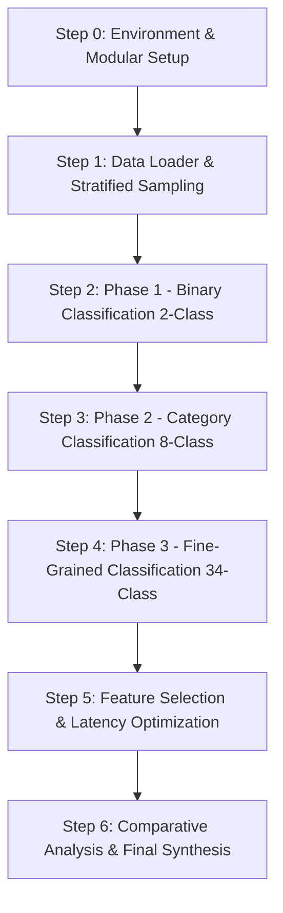

# Capstone Project Roadmap: IoT Intrusion Detection System (CICIoT2023)

## Project Overview
This project develops an end-to-end Machine Learning and Deep Learning pipeline for IoT Network Intrusion Detection using the **CICIoT2023** benchmark dataset.
Following an incremental, phased approach, models are built and evaluated across three levels of classification granularity:
1. **Phase 1: Binary Classification (2 Classes)** &mdash; `Attack` vs. `Benign`
2. **Phase 2: Functional Category Classification (8 Classes)** &mdash; `DDoS`, `DoS`, `Mirai`, `Recon`, `Spoofing`, `Web`, `BruteForce`, `Benign`
3. **Phase 3: Fine-Grained Attack Classification (34 Classes)** &mdash; All 33 specific attack vectors + `Benign`

> **Note**: As requested, all original files (`example.ipynb`, `MERGED_CSV/`, and existing PDFs) remain strictly untouched. All new modules, notebooks, and scripts will be created in dedicated new directories.

---

## Architecture & Directory Structure

To keep the codebase modular, reusable, and reproducible, new files will follow this structure:

```
capstone/
├── MERGED_CSV/                          # (Original untouched dataset)
├── example.ipynb                        # (Original untouched notebook)
├── PROJECT_ROADMAP.md                   # This roadmap document
├── requirements.txt                     # Project dependencies
├── src/                                 # Modular Python package
│   ├── __init__.py
│   ├── config.py                        # Dataset paths, 39 feature schema, label mappings
│   ├── data_loader.py                   # Chunked/streaming readers, sampling functions
│   ├── preprocessing.py                 # Normalization (StandardScaler), train/test splitters
│   ├── models.py                        # Model definitions (Tree, Boosting, Deep Learning)
│   ├── evaluate.py                      # Metrics, confusion matrix generation, PR curves
│   └── utils.py                         # Plotting helpers, timing and latency profiler
├── data/                                # Generated sample subsets (stratified, balanced)
│   └── sample_stratified.csv            # Manageable stratified working dataset
├── notebooks/                           # Step-by-step interactive notebooks
│   ├── 01_data_exploration_sampling.ipynb
│   ├── 02_phase1_binary_classification.ipynb
│   ├── 03_phase2_eight_class_classification.ipynb
│   └── 04_phase3_thirtyfour_class_classification.ipynb
├── models_saved/                        # Exported model weights/checkpoints (.pkl, .pt)
└── results/                             # Evaluation outputs
    ├── figures/                         # Confusion matrices, ROC/PR curves, feature importance
    └── tables/                          # Metric summaries (Accuracy, Macro F1, Recall, Latency)
```

---

## Detailed Step-by-Step Task Breakdown



---

### Step 0: Environment & Core Framework Setup
- [x] **Task 0.1**: Create `requirements.txt` specifying exact dependencies:
  - `pandas`, `numpy`, `scipy`
  - `scikit-learn`, `lightgbm`, `xgboost`
  - `torch` (PyTorch)
  - `matplotlib`, `seaborn`
  - `tqdm`, `joblib`, `ipykernel`
- [x] **Task 0.2**: Verify / setup Python virtual environment using `uv venv` and install all dependencies strictly inside `.venv`.
- [x] **Task 0.3**: Initialize project package directories (`src/`, `notebooks/`, `data/`, `models_saved/`, `results/figures/`, `results/tables/`).
- [x] **Task 0.4**: Implement `src/config.py`:
  - Verified and listed the exact **39 features** present in `MERGED_CSV/` (handling `Time_To_Live`, `Rate`, `IGMP`, etc.).
  - Defined label mapping dictionaries for **2 classes** (`Attack` vs. `Benign`).
  - Defined label mapping dictionaries for **8 classes** (`DDoS`, `DoS`, `Mirai`, `Recon`, `Spoofing`, `Web`, `BruteForce`, `Benign`).
  - Defined 34-class label encoder / index mappings (handling all uppercase dataset labels).

---

### Step 1: Data Engineering & Stratified Sampling
- [x] **Task 1.1**: Implement `src/data_loader.py` with memory-safe batch processing:
  - Streaming iterator over the 63 CSV files in `MERGED_CSV/`.
  - Memory-efficient dtype specifications (`float32` for features, categorical label).
- [x] **Task 1.2**: Implement stratified subsampling script (`src/create_sample.py`):
  - Created balanced working sample of **529,562 records** (`data/sample_stratified.csv`, 106.5 MB).
  - Capped majority DDoS/DoS flooding classes while **retaining 100% of all rare classes** (Web attacks, Brute Force, Ping Sweep, Backdoor). All 34 classes verified present.
- [x] **Task 1.3**: Implement `src/preprocessing.py`:
  - Outlier and missing value sanitization.
  - Leak-free `StandardScaler` pipeline fitted strictly on training partition.
  - Stratified 80/20 train/test split with target encoders for 2, 8, and 34 classes.
- [x] **Task 1.4**: Create `notebooks/01_data_exploration_sampling.ipynb` to visualize class distributions and verify pipeline.

---

### Step 2: Phase 1 &mdash; Binary Classification (2 Classes: Attack vs. Benign)
- [x] **Task 2.1**: Define binary classification baseline models in `src/models.py`:
  - Linear Baseline: `SGDClassifier` (log-loss / logistic regression with class weighting).
  - Tree Baseline: `RandomForestClassifier` (optimized for large tabular flows).
  - Gradient Boosted Trees: `LGBMClassifier` & `XGBClassifier`.
  - Neural Network Baseline: `PyTorchTabularDNN` with BatchNorm, Dropout, and AdamW.
- [x] **Task 2.2**: Train and validate binary models:
  - Benchmarked training duration and per-sample inference latency.
  - Recorded performance metrics on 105,913 test instances: Accuracy, Precision, Recall, Macro F1, Weighted F1, ROC-AUC, and PR-AUC.
- [x] **Task 2.3**: Generate binary evaluation reports in `results/`:
  - Generated and saved normalized confusion matrix heatmaps to `results/figures/binary_cm_*.png`.
  - Saved ROC & Precision-Recall curves to `results/figures/binary_roc_pr_*.png`.
  - Saved trained model checkpoints to `models_saved/binary/` (`.joblib` and `.pt`).
  - Generated `results/tables/binary_models_benchmark.csv`.
- [x] **Task 2.4**: Create `notebooks/02_phase1_binary_classification.ipynb` documenting experiments, findings, and decision boundaries. Pre-rendered with all outputs.

---

### Step 3: Phase 2 &mdash; Functional Category Classification (8 Classes)
- [ ] **Task 3.1**: Configure 8-class target mapping:
  - Grouping the 34 raw labels into: `DDoS`, `DoS`, `Mirai`, `Recon`, `Spoofing`, `Web`, `BruteForce`, and `Benign`.
- [ ] **Task 3.2**: Address multi-class category imbalance:
  - Compare **Unweighted Baseline** vs. **Balanced Class Weighting** (`compute_class_weight`) vs. **SMOTE** oversampling on minority categories (`Web`, `BruteForce`).
- [ ] **Task 3.3**: Train and compare candidate models:
  - Random Forest (Bagging ensemble).
  - LightGBM (Histogram-based leaf-wise gradient boosting).
  - XGBoost (Depth-wise gradient boosting).
  - Deep Neural Network (DNN with Dropout and BatchNorm).
- [ ] **Task 3.4**: Detailed 8-class evaluation:
  - Per-class classification reports (Precision, Recall, F1 for each of the 8 classes).
  - 8x8 normalized Confusion Matrix heatmap (highlighting where minority classes are misclassified).
  - Macro F1 vs. Accuracy comparison (demonstrating why raw accuracy is misleading on imbalanced datasets).
- [ ] **Task 3.5**: Save best performing 8-class model to `models_saved/category_8class/`.
- [ ] **Task 3.6**: Create `notebooks/03_phase2_eight_class_classification.ipynb`.

---

### Step 4: Phase 3 &mdash; Fine-Grained Attack Classification (34 Classes)
- [ ] **Task 4.1**: Configure 34-class label encoder:
  - Full evaluation across all 33 individual attack profiles + Benign traffic.
- [ ] **Task 4.2**: Advanced model training:
  - Hyperparameter tuning for top performing model (e.g., LightGBM / XGBoost).
  - Train Deep Neural Network (PyTorch) with Focal Loss to penalize minority misclassification.
  - *(Optional / Advanced)*: Hybrid 1D-CNN + LSTM architecture to evaluate spatial and sequential feature representations.
- [ ] **Task 4.3**: Comprehensive 34-class evaluation:
  - Full 34-class classification report (macro, micro, and weighted averages).
  - High-resolution 34x34 confusion matrix heatmap.
  - Specific deep-dive into stealthy minority vectors:
    - `SQLINJECTION`, `XSS`, `COMMANDINJECTION`, `BROWSERHIJACKING`, `UPLOADING_ATTACK`
    - `DICTIONARYBRUTEFORCE`
    - `BACKDOOR_MALWARE`
    - `RECON-PINGSWEEP`
- [ ] **Task 4.4**: Save model artifacts and predictions to `models_saved/attack_34class/`.
- [ ] **Task 4.5**: Create `notebooks/04_phase3_thirtyfour_class_classification.ipynb`.

---

### Step 5: Feature Importance & Inference Latency Optimization
- [ ] **Task 5.1**: Feature Importance Analysis:
  - Compute SHAP values or Gini / Gain-based tree feature importance across the 39 features.
  - Identify redundant features (e.g. rate metrics and flag counters with near-zero gain).
- [ ] **Task 5.2**: Feature Space Reduction:
  - Select optimal reduced feature subset (**18 to 22 features**).
  - Re-train models on the reduced feature space.
- [ ] **Task 5.3**: Trade-off Analysis:
  - Measure accuracy/F1 delta: full 39 features vs. reduced ~20 features.
  - Measure inference latency speedup (microsecond per flow & throughput in flows/sec).
  - Evaluate edge-readiness for resource-constrained IoT devices (e.g., Raspberry Pi / ESP32 gateway).

---

### Step 6: Capstone Synthesis, Comparison & Presentation
- [ ] **Task 6.1**: Master comparative synthesis:
  - Summary matrix comparing **2-Class vs. 8-Class vs. 34-Class** performance.
  - Comparison table across all model families (Logistic Regression, Random Forest, LightGBM, XGBoost, DNN).
- [ ] **Task 6.2**: Visualizations generation:
  - Multi-panel publication-quality figures saved to `results/figures/`.
  - Performance vs. Complexity / Latency frontier curves.
- [ ] **Task 6.3**: Final Capstone Summary Report:
  - Document key findings, limitations, trade-offs, and defense-ready conclusions.

---

## Progress Tracking Status

| Phase | Granularity | Classes | Status | Target Deliverable |
| :--- | :--- | :---: | :---: | :--- |
| **Step 0: Setup** | Environment & Config | &mdash; |  Completed | `.venv`, `requirements.txt`, `src/config.py` |
| **Step 1: Data** | Sampling & Loader | &mdash; |  Completed | `src/data_loader.py`, `src/create_sample.py`, `data/sample_stratified.csv` |
| **Phase 1** | Binary Detection | 2 |  Completed | `02_phase1_binary_classification.ipynb`, metrics table & models |
| **Phase 2** | Category Detection | 8 | ⏳ Next Up | `03_phase2_eight_class_classification.ipynb`, 8x8 confusion matrix |
| **Phase 3** | Attack Profile Detection | 34 | ⏳ Pending | `04_phase3_thirtyfour_class_classification.ipynb`, 34x34 matrix |
| **Optimization** | Feature Selection & Latency | 18&ndash;22 feats | ⏳ Pending | Latency benchmarks & SHAP ranking |
| **Synthesis** | Final Capstone Report | All | ⏳ Pending | Master comparative results & figures |
