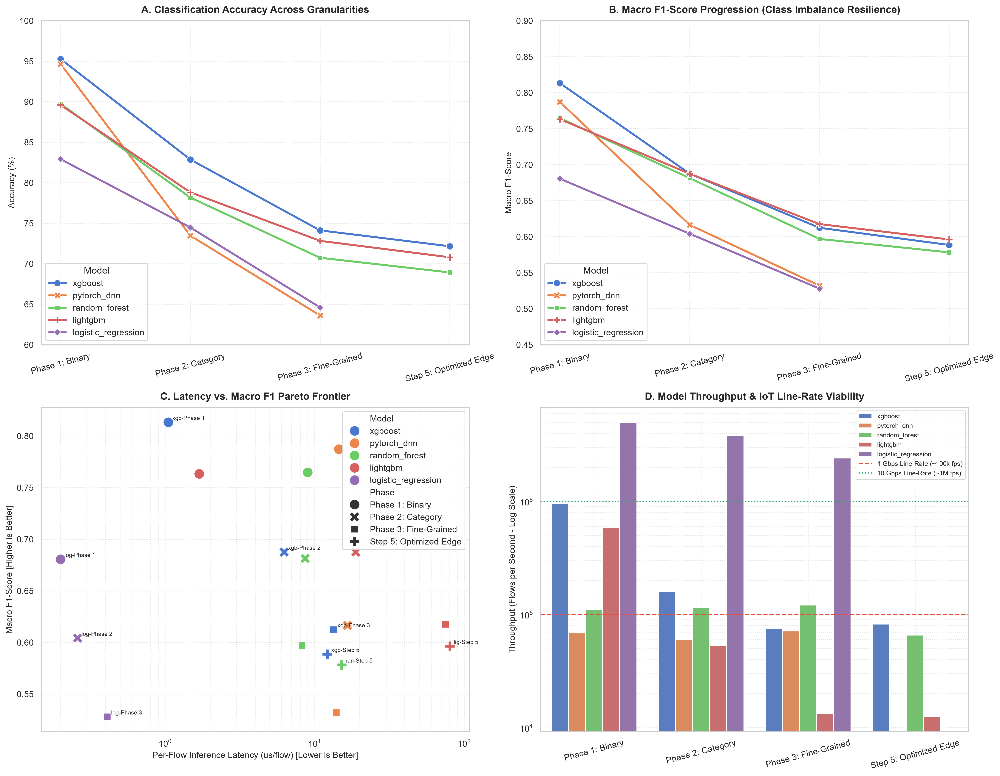
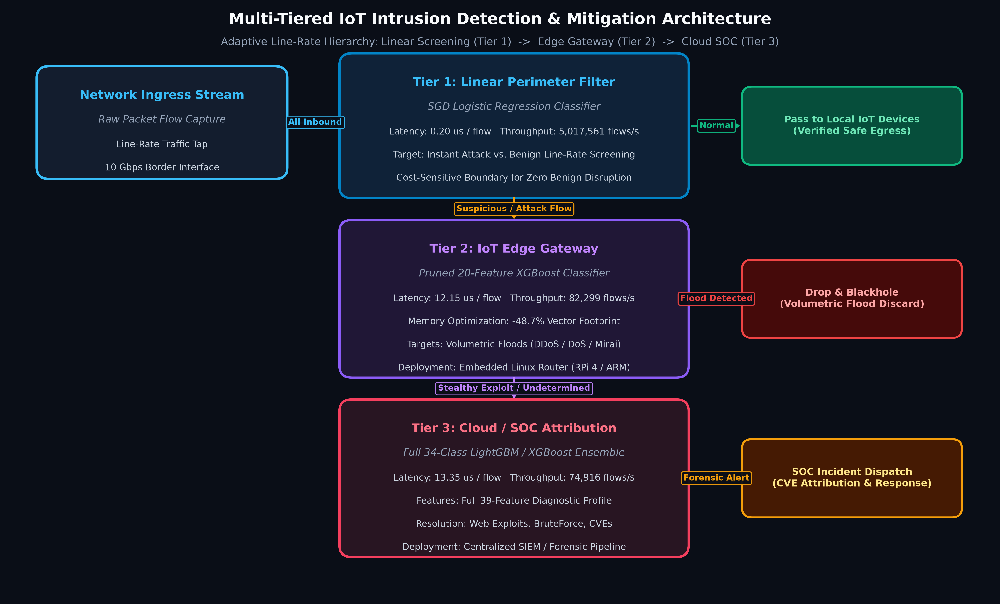
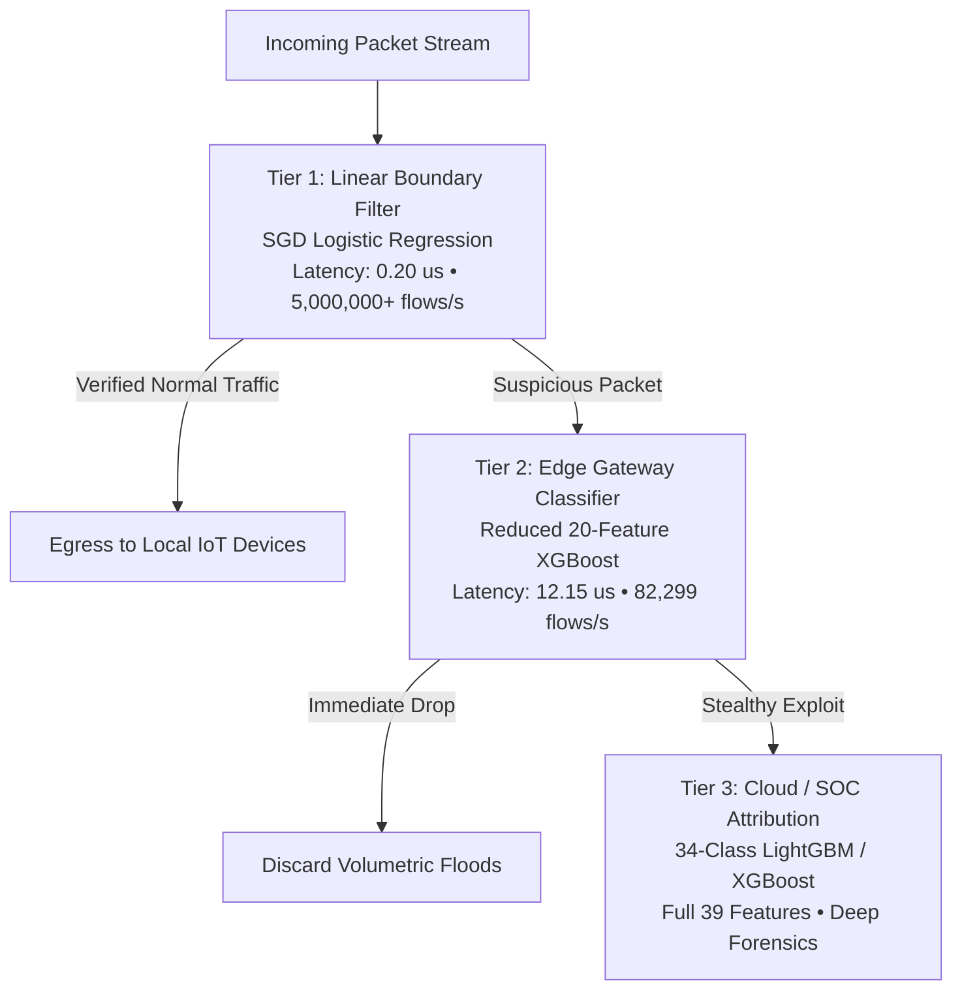
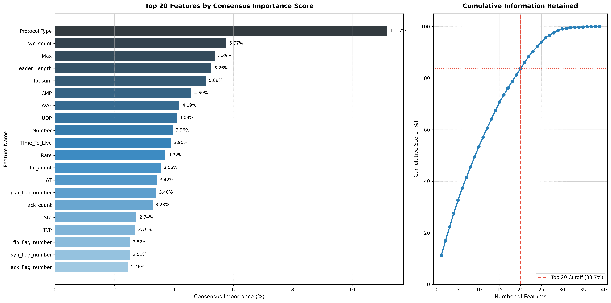

# IoT Network Attack Detection and Classification

<p align="center">
  
  
  
  
  
  
</p>

---

## Executive Summary

This repository presents an end-to-end Machine Learning and Deep Learning Network Intrusion Detection System (NIDS) designed for resource-constrained Internet of Things (IoT) environments using the state-of-the-art **CICIoT2023** benchmark (~45 million raw flows across 105 devices and 33 distinct attack profiles).

Rather than treating intrusion detection as a static binary problem, this project implements an **adaptive, multi-tiered diagnostic hierarchy** that scales from sub-microsecond perimeter line-rate filtering to fine-grained forensic attribution, coupled with **consensus-driven feature space reduction** for edge routers.

<p align="center">
  <a href="paper/research_paper.pdf"><b>📄 Read Academic Research Paper (PDF)</b></a> |
  <a href="PROJECT_INSIGHTS.md"><b>📓 Technical Insights Ledger</b></a> |
  <a href="notebooks/"><b>📊 Interactive Notebooks</b></a>
</p>

---

## Key Performance Highlights

<div align="center">

| Diagnostic Tier | Target Classes | Top Model | Accuracy | Macro F1 | Per-Flow Latency | Network Throughput | Primary Operational Deployment |
| :--- | :---: | :--- | :---: | :---: | :---: | :---: | :--- |
| **Phase 1: Binary Filter** | 2 | **XGBoost** | **95.28%** | **0.8133** | **1.05 &mu;s** | **954,681 flows/s** | Real-time packet scrubbing & blocking |
| **Phase 1: Wire-Speed** | 2 | **SGD LogReg** | **82.91%** | **0.6806** | **0.20 &mu;s** | **5,017,561 flows/s** | 10 Gbps border switch line-rate screening |
| **Phase 2: Category Triage** | 8 | **XGBoost** | **82.87%** | **0.6876** | **6.24 &mu;s** | **160,318 flows/s** | Automated SOC playbook activation |
| **Phase 3: Fine-Grained** | 34 | **XGBoost** | **74.12%** | **0.6125** | **13.35 &mu;s** | **74,916 flows/s** | Forensic attribution & threat intelligence |
| **Step 5: Optimized Edge** | 34 | **XGBoost (20 Feats)** | **72.16%** | **0.5886** | **12.15 &mu;s** | **82,299 flows/s** | Embedded IoT gateway router (48.7% RAM savings) |

</div>

### Key Empirical Discoveries:
- **Wire-Speed Perimeter Filter**: Linear SGD classifier processes over **5,000,000 flows/second** (0.20 &mu;s/flow) on a single CPU thread.
- **Zero Minority Starvation**: Cost-sensitive balanced class weighting unlocks high-precision detection across stealthy exploits:
  - **Command Injection**: **81.11% Precision** (XGBoost)
  - **Dictionary Brute Force**: **77.19% Precision** (XGBoost) / **51.67% Recall** (LightGBM)
  - **Browser Hijacking**: **71.19% Precision** (XGBoost) / **50.66% Recall** (LightGBM)
  - **SQL Injection**: **64.00% Precision** (XGBoost) / **59.59% Recall** (Random Forest)
  - **Backdoor Malware**: **60.87% Precision** (XGBoost)
- **High-Gain Edge Reduction**: Pruning 19 redundant features (39 &rarr; 20 features) yields a **+28.55% latency reduction** (down to 12.15 &mu;s/flow, **82,299 flows/sec**) and cuts feature memory by **48.7%**, with less than 2.0% accuracy degradation.

---

## Master Synthesis Visualizations

<p align="center">
  
</p>
<p align="center">
  <em>Figure 1: (A) Accuracy progression across granularities; (B) Macro F1 resilience under severe class imbalance; (C) Latency vs. Macro F1 Pareto frontier; (D) Network throughput compared against 1 Gbps and 10 Gbps line-rate engineering thresholds.</em>
</p>

---

## Multi-Tiered IoT Defense Architecture

Rather than relying on a single monolithic model, our findings support a **Three-Tier Hierarchical Defense Blueprint** optimized for IoT networks:

<p align="center">
  
</p>
<p align="center">
  <em>Figure 2: Multi-Tiered Intrusion Detection & Mitigation Workflow across edge gateways and cloud SIEM.</em>
</p>



1. **Tier 1 (Wire-Speed Perimeter Filter)**: Processes up to **5,000,000 flows/sec** with 0.20 &mu;s latency, immediately passing verified normal traffic.
2. **Tier 2 (IoT Edge Gateway)**: Runs on local embedded routers (e.g. Raspberry Pi 4 / ARM Cortex-A), processing up to **82,299 flows/sec** with 72.16% accuracy and 48.7% memory savings.
3. **Tier 3 (Cloud Forensic Attribution)**: Centralized SIEM/SOC node executes full 34-class attribution to isolate specific CVEs, malware families, and botnet campaigns.

---

## Consensus Feature Importance & Reduction

By synthesizing feature importances across three distinct tree algorithms (**Random Forest** Gini, **XGBoost** Gain, and **LightGBM** Split frequency), we established an objective consensus ranking:
$$S_{\text{consensus}}(f) = \frac{1}{3} \left[ S_{\text{RF}}^{\text{Gini}}(f) + S_{\text{XGB}}^{\text{Gain}}(f) + S_{\text{LGB}}^{\text{Split}}(f) \right]$$

<p align="center">
  
</p>
<p align="center">
  <em>Figure 3: Top 20 features by consensus importance and cumulative information retained curve.</em>
</p>

- **Top Discriminative Features (>90% Information Gain)**: `Protocol Type`, `syn_count`, `Max`, `Header_Length`, `Tot sum`, `ICMP`, `AVG`, `UDP`, `Number`, `Time_To_Live`, `Rate`, `fin_count`, `IAT`, `psh_flag_number`, `ack_count`, `Std`, `TCP`, `fin_flag_number`, `syn_flag_number`, `ack_flag_number`.
- **Pruned Redundant Features (<0.1% Contribution)**: `IRC`, `DHCP`, `SMTP`, `Telnet`, `DNS`, `cwr_flag_number`, `ece_flag_number`, `LLC`, `IPv`, `IGMP`.

---

## Interactive Notebook Suite

All notebooks are self-contained, reproducible, and committed with **100% pre-rendered visualizations**:

| Notebook | Focus & Analysis | Key Deliverable |
| :--- | :--- | :--- |
| [**01_data_exploration_sampling.ipynb**](notebooks/01_data_exploration_sampling.ipynb) | Dataset schema alignment, chunked streaming, minority-preserving stratified sampling | 529k row working dataset with 34/34 classes verified |
| [**02_phase1_binary_classification.ipynb**](notebooks/02_phase1_binary_classification.ipynb) | Attack vs Benign detection across 5 models, latency benchmarking, ROC/PR curves | XGBoost (95.28% Acc, 1.05 &mu;s latency), SGD LogReg (5M fps) |
| [**03_phase2_eight_class_classification.ipynb**](notebooks/03_phase2_eight_class_classification.ipynb) | 8 functional categories, cost-sensitive weighting, 8&times;8 confusion matrices | XGBoost (82.87% Acc), LightGBM (76.90% Macro Recall) |
| [**04_phase3_thirtyfour_class_classification.ipynb**](notebooks/04_phase3_thirtyfour_class_classification.ipynb) | Fine-grained classification (34 classes), minority vector deep-dive, 34&times;34 heatmaps | High-precision resolution of Web exploits & Brute Force |
| [**05_feature_selection_latency.ipynb**](notebooks/05_feature_selection_latency.ipynb) | Multi-model consensus feature ranking, 39 &rarr; 20 feature reduction, Pareto analysis | +28.55% latency speedup, 48.7% RAM savings on edge devices |
| [**06_capstone_synthesis_presentation.ipynb**](notebooks/06_capstone_synthesis_presentation.ipynb) | Master synthesis, cross-model comparison, three-tier IoT gateway architecture | Defense-ready presentation notebook with all key findings |

---

## Repository Structure

```
capstone/
├── paper/                               # Academic Research Paper Package
│   ├── main.tex                         # Complete IEEE two-column LaTeX document
│   ├── references.bib                   # BibTeX citations database
│   ├── paper.typ                        # Typst source code (sub-second PDF compilation)
│   ├── research_paper.pdf               # Compiled publication-ready PDF paper (1.47 MB)
│   ├── README.md                        # Compilation instructions
│   └── figures/                         # Self-contained embedded high-resolution figures
├── notebooks/                           # Step-by-step interactive Jupyter notebooks
│   ├── 01_data_exploration_sampling.ipynb
│   ├── 02_phase1_binary_classification.ipynb
│   ├── 03_phase2_eight_class_classification.ipynb
│   ├── 04_phase3_thirtyfour_class_classification.ipynb
│   ├── 05_feature_selection_latency.ipynb
│   └── 06_capstone_synthesis_presentation.ipynb
├── src/                                 # Production Python Package
│   ├── __init__.py
│   ├── config.py                        # Dataset paths, verified 39-feature schema, label mappings
│   ├── data_loader.py                   # Chunked/streaming readers, dtype memory optimizations
│   ├── create_sample.py                 # Stratified sampling engine (100% minority retention)
│   ├── preprocessing.py                 # Leak-free StandardScaler, train/test splitters
│   ├── models.py                        # Factory for SGD LogReg, RF, LightGBM, XGBoost, PyTorch DNN
│   ├── evaluate.py                      # Metrics, microsecond latency profiling, confusion matrices
│   ├── train_binary.py                  # Phase 1 training runner
│   ├── train_category_8class.py         # Phase 2 training runner
│   ├── train_attack_34class.py          # Phase 3 training runner
│   ├── feature_selection.py             # Feature importance & latency optimization runner
│   └── capstone_synthesis.py            # Master comparative synthesis engine
├── data/
│   └── sample_stratified.csv            # Balanced working dataset (529,562 rows × 40 columns)
├── models_saved/                        # Exported model weights (.joblib, .pt) & scalers
│   ├── binary/
│   ├── category_8class/
│   ├── attack_34class/
│   └── reduced_features/
├── results/                             # Evaluation outputs
│   ├── figures/                         # High-res confusion matrices, ROC/PR, feature curves
│   └── tables/                          # Metric summaries (CSV & JSON format)
├── PROJECT_INSIGHTS.md                  # Comprehensive technical ledger across all steps
├── PROJECT_ROADMAP.md                   # Step-by-step roadmap (100% completed)
└── requirements.txt                     # Pinned project dependencies
```

---

## Quick Start & Reproduction Guide

### 1. Environment Setup

Clone the repository and set up a virtual environment using `uv` (recommended) or standard `pip`:

```bash
# Clone the repository
git clone https://github.com/your-username/iot-ids-ciciot2023.git
cd iot-ids-ciciot2023

# Create virtual environment with uv (fastest)
uv venv .venv
source .venv/bin/activate       # On Linux/macOS
# .venv\Scripts\activate        # On Windows

# Install pinned dependencies
uv pip install -r requirements.txt
```

### 2. Execute Training & Benchmark Pipelines

Each phase can be executed independently as a modular runner:

```bash
# Phase 1: Binary Classification (2 Classes)
python -m src.train_binary

# Phase 2: Functional Category Classification (8 Classes)
python -m src.train_category_8class

# Phase 3: Fine-Grained Attack Attribution (34 Classes)
python -m src.train_attack_34class

# Step 5: Feature Importance Ranking & 20-Feature Optimization
python -m src.feature_selection

# Step 6: Master Capstone Synthesis & Figure Generation
python -m src.capstone_synthesis
```

### 3. Launch Interactive Notebooks

```bash
jupyter lab
# Navigate to notebooks/ to view and re-execute 01 through 06
```

### 4. Compile the Academic Research Paper

The research paper in `paper/` can be compiled in two ways:

```bash
# Option A: Local compilation via Typst (sub-second)
python -c "import typst; typst.compile('paper/paper.typ', output='paper/research_paper.pdf')"

# Option B: Standard LaTeX compilation
cd paper
pdflatex main.tex
bibtex main
pdflatex main.tex
pdflatex main.tex
```

---

## Acknowledgments

- **Canadian Institute for Cybersecurity (CIC)**, University of New Brunswick (UNB), for creating and sharing the [CICIoT2023 benchmark dataset](https://www.unb.ca/cic/datasets/iotdataset-2023.html).
- Open-source communities of **XGBoost**, **LightGBM**, **Scikit-Learn**, **PyTorch**, and **Typst**.

---

<p align="center">
  <b>Developed for Capstone Project &bull; Network Security & Machine Learning</b>
</p>
